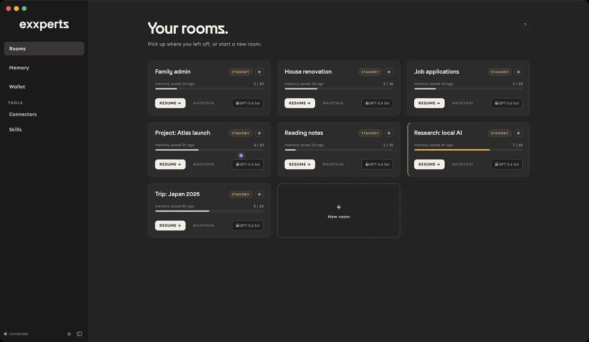
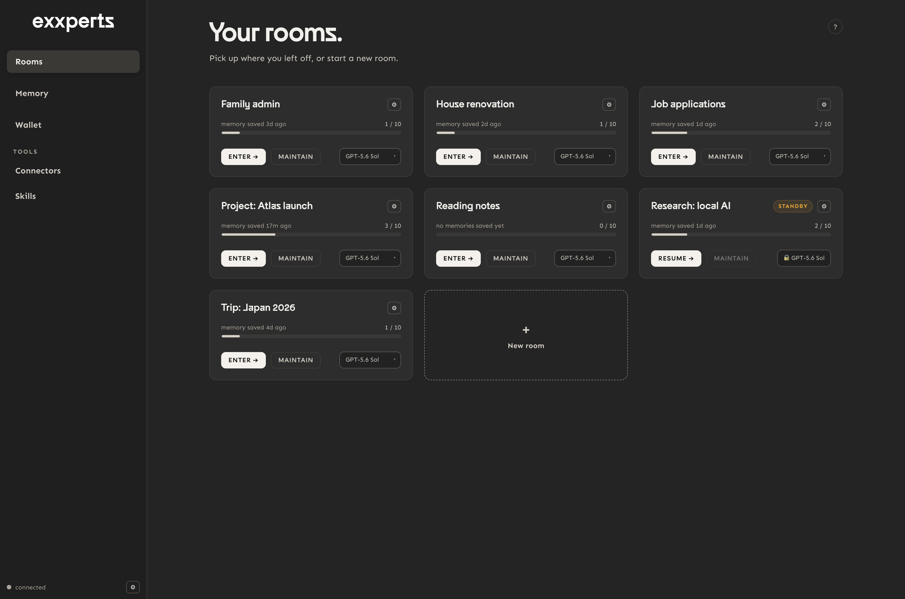
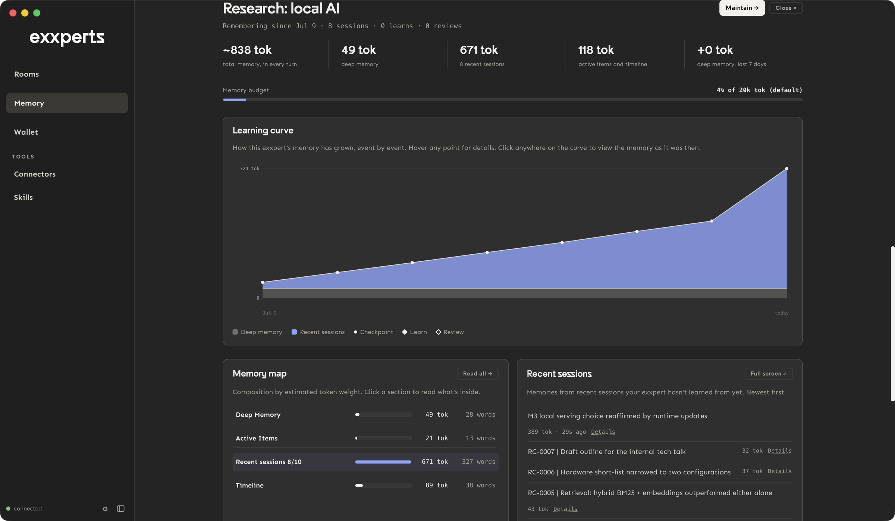

<div align="center">
  <picture>
    <source media="(prefers-color-scheme: dark)" srcset="docs/assets/exxperts-logo-negative.png">
    
  </picture>
</div>

<p align="center"><b>AI colleagues that learn and remember. On your machine, under your control.</b></p>

<p align="center">exxperts gives you rooms: persistent AI colleagues with real hands. A room searches the web, writes documents and decks, runs delegated work, and it grows the way you work with it.</p>

<p align="center">
  <a href="https://github.com/EXXETA/exxperts/actions/workflows/ci.yml"></a>
  <a href="LICENSE"></a>
  <a href="https://github.com/EXXETA/exxperts/releases"></a>
  
</p>

<p align="center">
<a href="#download-the-app">Download</a> ·
<a href="#see-it">See it</a> ·
<a href="#how-a-room-grows">How it works</a> ·
<a href="#why-exxperts">Why exxperts</a> ·
<a href="#install">Install</a> ·
<a href="#ways-to-use-exxperts">Ways to use it</a> ·
<a href="#documentation">Docs</a>
</p>

## Download the app

The easiest way to run exxperts: a desktop app, no terminal, no setup.

<p align="center">
  <a href="https://github.com/EXXETA/exxperts/releases/latest/download/exxperts-desktop-mac-arm64.dmg"></a>
  &nbsp;&nbsp;
  <a href="https://github.com/EXXETA/exxperts/releases/latest/download/exxperts-setup-win-x64.exe"></a>
</p>

<p align="center"><sub>Also available: <a href="https://github.com/EXXETA/exxperts/releases/latest/download/exxperts-desktop-win-x64.zip">Windows portable zip</a> · <a href="https://github.com/EXXETA/exxperts/releases/latest/download/exxperts-desktop-mac-arm64.zip">macOS zip</a> · checksums on <a href="https://github.com/EXXETA/exxperts/releases">Releases</a></sub></p>

First launch: macOS asks you to confirm an unsigned app (open it once, then System Settings → Privacy & Security → *Open Anyway*); Windows shows a SmartScreen prompt (*More info → Run anyway*). One time only; signed builds are coming.

Prefer a terminal? See [Install](#install).

## See it



Every memory shows **where it came from**: click any remembered fact and the exact conversation it was learned from opens. The growth chart is clickable time travel: pick a day, read everything your AI knew then.






## How a room grows

**Work.** A room is a full agent, not a chat: it searches the web, reads pages, writes documents, decks and web pages, runs background tasks, and uses your connectors and skills. Which tools each room may use is your call.

**Checkpoint.** At the end of a session, the room proposes what is worth remembering. You steer it, edit it, or reject it; nothing enters memory without you.

**Learn.** After several sessions, the room consolidates its notes into durable long-term memory, and you review the update before it is written. This is how a room stops being a tool and starts becoming a colleague: session by session, it knows more of your work.

Every memory traces back to the conversation it came from, and everything a room is lives as plain files on your machine. Switch AI providers anytime, and you keep the colleague.

## Why exxperts

- **Memory is opt-in, not automatic.** The AI remembers only what you explicitly approve: every proposed memory passes a review gate before it's written.
- **Every memory has a receipt.** Each fact links back to the conversation it came from, and time travel shows exactly what your AI knew on any given day.
- **You can see what the model saw.** The full context behind any answer is inspectable, so replies can be audited rather than taken on faith.
- **Memory you can correct.** Inspect, maintain, and reset what's remembered; wrong facts don't fossilize.
- **Everything lives on your machine.** Memory, conversations, credentials: plain files on your disk. No cloud account, no telemetry; nothing leaves your machine unless you send it.
- **No provider lock-in.** Claude, ChatGPT, Gemini, Mistral, or any OpenAI-compatible endpoint, including local models; switching keeps everything your AI has learned, and a provider outage never strands your work.

Most local AI tools are chat interfaces with hidden state. exxperts is built around governed memory: lean by design, and the more you work with it, the sharper it gets.

## Install

The app above needs nothing else. For the terminal experience:

**macOS / Linux**
```bash
curl -fsSL https://raw.githubusercontent.com/EXXETA/exxperts/main/install.sh | bash
```

**Windows (PowerShell)**
```powershell
irm https://raw.githubusercontent.com/EXXETA/exxperts/main/install.ps1 | iex
```

Then run `exxperts web`: your browser opens, signed in. Web search is built in via DuckDuckGo, no setup needed ([limits](docs/web-search.md)). Re-run the same command anytime to update.

<details>
<summary>Requirements, troubleshooting, and platform notes</summary>

- Prebuilt archives (bundled runtime, checksum-verified) for macOS Apple Silicon, Windows x64, Linux x64; everything else builds from source automatically (needs Git + Node.js ≥ 20.6).
- An AI subscription (Claude or ChatGPT) or any API key / OpenAI-compatible gateway; sign in via **AI setup** in the app. All provider paths: [docs/provider-setup.md](docs/provider-setup.md).
- `exxperts doctor` checks any install and prints the fix for whatever's missing.
- Windows notes, corporate networks, per-user Git installs, PowerShell policies, proxy/TLS: see [docs/quickstart.md](docs/quickstart.md).
- Contributors: `git clone` + `npm install` + `npm run install:global` builds and installs the commands from source; [CONTRIBUTING.md](CONTRIBUTING.md) has the full setup.
</details>

## Ways to use exxperts

One product, one shared brain (`~/.exxperts`), several doors; open whichever fits the moment:

| Door | Get it | Updates | Terminal needed |
|---|---|---|---|
| **Desktop app** | [Download](#download-the-app) | In-app notice → download the new version | Never |
| **Browser** (`exxperts web`) | One-liner above · or *Open in Browser* from the app | Re-run the one-liner | To start it |
| **Terminal** (`exxperts cli`) | Same install | Same | Yes |
| **Clone & build** | `git clone` | `git pull` | Yes |

The app is self-contained and always runs its own version; a terminal install updates separately. Already installed via the terminal? **The app uses the same data, just download and open it.** Only one server runs at a time, whichever door you opened.

### What's inside

Persistent rooms with governed memory · artifacts (documents, decks, pages your rooms produce) · delegated background tasks · skills · MCP connectors · scheduled work · built-in web search (DuckDuckGo with no setup; [SearXNG](docs/web-search.md) for heavy use or networks where DuckDuckGo blocks automated queries) · a health check (`exxperts doctor` / in-app) · multi-provider wallet.

### Documentation

[Quickstart](docs/quickstart.md) · [How exxperts works](docs/how-exxperts-works.md) · [Web search](docs/web-search.md) · [Security & threat model](SECURITY.md) · [Desktop app](apps/desktop/README.md) · [Contributing](CONTRIBUTING.md) · [Docs index](docs/README.md)

### License

[PolyForm Noncommercial](LICENSE). Free for personal and other noncommercial use; commercial licensing (including internal business use) via EXXETA. *Why this license: we want individuals and teams to use exxperts freely while we build; commercial terms fund exactly that.*

exxperts is designed and built by **Borja Odriozola Schick** ([@borcho23](https://github.com/borcho23)) and **Fernando Pastor Alonso** ([@ferpastoralonso](https://github.com/ferpastoralonso)) at [Exxeta](https://exxeta.com). It is built on [Pi](https://github.com/badlogic/pi-mono) by Mario Zechner; the bundled runtime under `runtime/` is derived from Pi (v0.70.5, MIT), with the upstream license preserved in [`runtime/LICENSE`](runtime/LICENSE) and the fork documented in [`runtime/NOTICE.md`](runtime/NOTICE.md). Third-party product names and logos in the connector directory are trademarks of their respective owners (glyphs from [Simple Icons](https://simpleicons.org), CC0), used for identification only. Contact: borja.odriozola.schick@exxeta.ch and fernando.pastor@exxeta.ch
