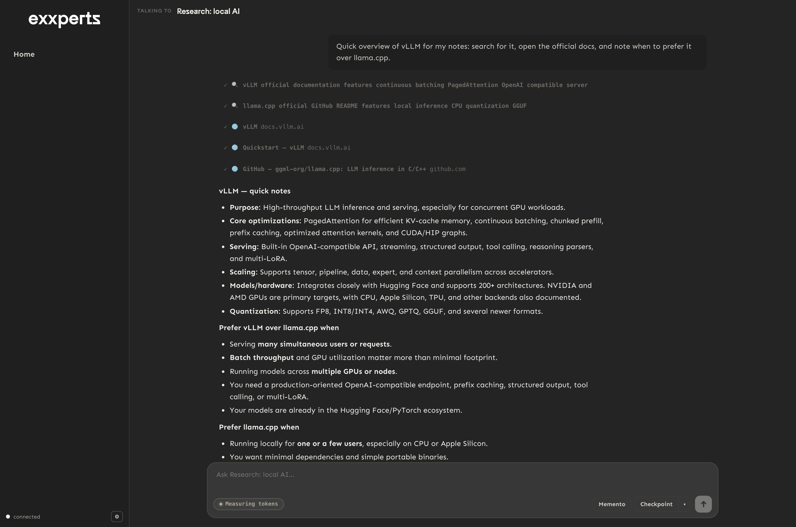
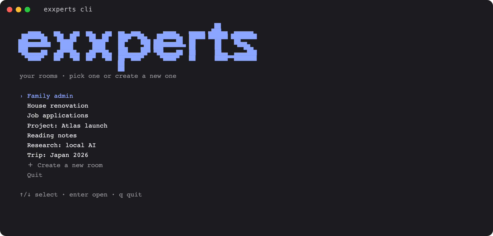
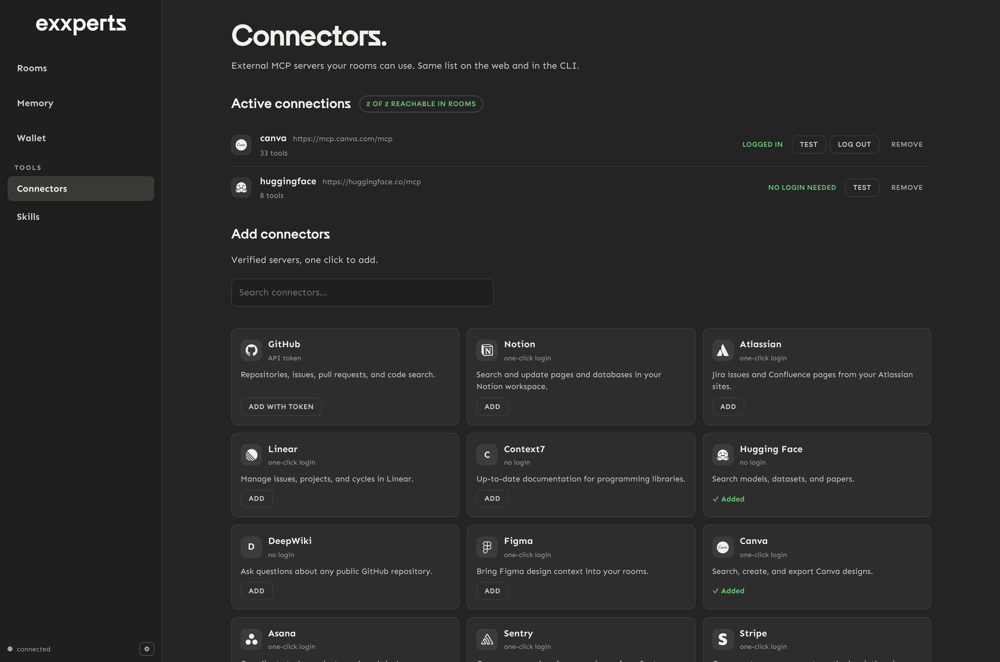

<div align="center">
  <picture>
    <source media="(prefers-color-scheme: dark)" srcset="docs/assets/exxperts-logo-negative.png">
    
  </picture>
</div>

<h3 align="center">Your AI's memory. On your machine, under your control.</h3>

<p align="center">
  <a href="https://github.com/EXXETA/exxperts/actions/workflows/ci.yml"></a>
  <a href="LICENSE"></a>
  <a href="https://github.com/EXXETA/exxperts/releases"></a>
  
</p>

<p align="center">
  exxperts gives you persistent AI rooms with governed, approval-gated memory: agents that remember you and your work across sessions, with every memory write approved by you. Everything runs and stays local: rooms, memory, knowledge base, artifacts, and usage data are files on your disk.
</p>


## Why exxperts

- **Memory you govern.** Rooms remember decisions, preferences, and context across sessions, but every memory write goes through an approval gate you control. No silent profile-building.
- **Local-first, verifiably.** Rooms, memories, knowledge base, artifacts, and token usage live as plain files under `~/.exxperts`. You can read, back up, or delete all of it. There is no telemetry: the only network traffic is what you use, meaning calls to your model provider, web research if you enable it, and any MCP connectors you add.
- **An agentic runtime, not a chat wrapper.** Rooms use curated tools (knowledge base, artifacts, local web research, MCP connectors) under a permission model scoped to each surface. Rooms never get an unrestricted shell.
- **One product, two surfaces.** The web app and the CLI/TUI share the same rooms, memory, and credential store; switch between them freely.

If you know [Open WebUI](https://github.com/open-webui/open-webui) or [AnythingLLM](https://github.com/Mintplex-Labs/anything-llm): those are excellent local chat/RAG frontends. exxperts is a different shape: a local agentic runtime focused on persistent, governed memory and auditable agent behaviour, not chat over your documents.




## One product, two surfaces

| Surface | Launch | What you get |
| --- | --- | --- |
| **Web app** | `exxperts web` | Rooms with memory, KB, artifacts, web research, approvals, and the wallet. |
| **CLI / TUI** | `exxperts cli` | The same rooms in your terminal, run from the folder you want as the workspace. |

<p align="center">
  
</p>

The web app is the full product: AI setup, memory review and approvals, the wallet, connectors, and skills all live there. The CLI/TUI focuses on the rooms themselves. Bare `exxperts` opens a picker for the two surfaces (web app recommended). Product/app state stays local under `~/.exxperts/app` (`%USERPROFILE%\.exxperts` on Windows); embedded runtime provider/auth/model/session state lives under `~/.exxperts/agent`.

## Product capabilities

- Local web workspace with landing page, persistent rooms, approvals, and wallet.
- Rooms-only CLI/TUI sharing the same room runtime and governance.
- Skills page in the web app: write a skill, upload .md/.zip/.skill files, or import from a repo, review before accepting, then enable per room.
- Room-to-room consult: @-mention another room in chat to ask it a question; it answers read-only from its own memory and context.
- Delegated tasks shown as task cards in chat, with artifacts viewable in a sandboxed artifacts viewer.
- Approval-gated memory, KB writes, and Markdown/HTML artifacts.
- Markdown/Obsidian KB tools and local web search.
- MCP connectors on web and CLI through a single proxy tool. Bring your own servers; see [`docs/mcp.md`](docs/mcp.md).
- Local token/cost wallet from `~/.exxperts/app/usage.jsonl`.



## Quick start

No prerequisites for the standard path beyond about 1 GB of free disk space. One command installs everything:

macOS / Linux:

```bash
curl -fsSL https://raw.githubusercontent.com/EXXETA/exxperts/main/install.sh | bash
```

Windows (PowerShell):

```powershell
irm https://raw.githubusercontent.com/EXXETA/exxperts/main/install.ps1 | iex
```

The installer downloads a prebuilt archive for your platform (no Node.js, npm, or Git needed) and installs the `exxperts` command. Prebuilt archives exist for macOS on Apple Silicon, Windows x64, and Linux x64. Release archives and their checksums are published on [GitHub Releases](https://github.com/EXXETA/exxperts/releases); [`docs/release-pipeline.md`](docs/release-pipeline.md) describes how they are built. On any other platform, or when the download fails, the same command automatically falls back to building from source: that path needs [git](https://git-scm.com), [Node.js](https://nodejs.org) 20.6+ with npm, and about 3 GB of free disk space (on Windows, [Git for Windows](https://gitforwindows.org) 2.40+), and clones the repo into `~/exxperts`. Setting the `EXXPERTS_DIR` environment variable picks the clone location and also selects the source flow directly. Re-run the same command anytime to update; `exxperts --version` tells you which version you are on.

Prefer to do it by hand? It is three commands. **On Windows, apply the two Git settings from the [Windows quickstart](#windows-quickstart) before cloning** (the one-line installer applies them to its clone for you):

```bash
git clone https://github.com/EXXETA/exxperts.git
cd exxperts
npm install
npm run install:global   # builds, packs, and installs the exxperts commands (all platforms)
```

Two things to expect: `npm install` also fetches headless Chromium (~150 MB, one-time; skip it with `EXXETA_SKIP_BROWSER_INSTALL=1 npm install`), and `install:global` builds the whole app before installing `@exxeta/exxperts-app` into your global npm prefix, so give it a few minutes.

Then, from any shell:

```bash
exxperts web   # the web app: rooms, memory, wallet (current folder does not matter)

cd /path/to/your/project
exxperts cli   # the same rooms in your terminal, with this folder as the workspace
```

First run: open **AI setup** in the web app and sign in to your provider (Claude and ChatGPT subscriptions sign in with one click; API keys and OpenAI-compatible gateways also work; see [Model/provider setup](#modelprovider-setup)). Something not working? `exxperts doctor` checks your install and the optional layers on any install type and prints the fix (contributors working from a clone can also use `npm run doctor`).

New here? [`docs/quickstart.md`](docs/quickstart.md) walks the whole path in about five minutes: install, connect your AI, first room, first memory. For an orientation on what the product is and how the pieces fit, read [`docs/how-exxperts-works.md`](docs/how-exxperts-works.md).

### Updating

Re-run the one-line install command from the quick start. On the platforms with prebuilt archives (macOS Apple Silicon, Windows x64, Linux x64) that performs an archive install even when your current install was built from source: it migrates you to the archive install, carries your settings (`app/.env`) over, and uninstalls the old npm-based global command (the clone itself is left in place). Archive installs update in place and keep the install's `app/.env`, with a transient disk peak of about 1.4 GB while the new tree is unpacked next to the old one. Want to stay on a source install instead? Re-run the installer with `EXXPERTS_INSTALL_METHOD=source`, or update by hand. Either way, your rooms, memory, and provider logins live in `~/.exxperts`, which installs and updates never touch. Updating a source install by hand is the same on every platform, from the repo folder:

```bash
git pull
npm install              # in case dependencies changed
npm run install:global   # rebuilds and reinstalls the global commands
```

The global `exxperts` commands then run the new version; confirm with `exxperts --version`. If anything misbehaves after an update, or anytime, run `exxperts doctor`. Developing from the clone instead of the global install? Update with `git pull && npm install && npm run build`.

## Windows quickstart

Windows is supported for both the web app and the CLI/TUI. The one-line installer from the quick start needs nothing preinstalled on Windows x64 (the platforms with prebuilt archives are macOS Apple Silicon, Windows x64, and Linux x64; other platforms automatically take the source path, which needs git and Node.js); the requirements below matter for two things only, shell access in rooms and installing from source (by hand or via the installer's fallback):

1. **Git for Windows ≥ 2.40** (https://gitforwindows.org), needed for the source install path and for rooms' optional shell tool: that tool runs commands through Git Bash's `bash.exe`, which is discovered automatically from your Git installation, whether machine-wide (`C:\Program Files\Git`) or per-user (`%LOCALAPPDATA%\Programs\Git`, the no-admin install), or on `PATH`. A WSL `bash` on `PATH` also works for rooms' shell tool; in that case commands run inside the WSL Linux environment (Windows drives under `/mnt/c`, the distro's own tools).
2. **Node.js 20.6+ (LTS recommended) and npm** (https://nodejs.org), needed for the source install path only; the prebuilt archive bundles its own Node runtime.
3. **Windows Terminal** recommended for the CLI/TUI (legacy conhost is untested).

One-time Git settings before cloning (long paths matter because `node_modules` trees exceed the 260-character `MAX_PATH`):

```powershell
git config --global core.longpaths true
git config --global core.autocrlf false   # the repo's .gitattributes manages line endings
```

Then install from PowerShell or Git Bash, with the same commands as everywhere else. Clone into a folder your user owns (for example under `%USERPROFILE%`, like `C:\Users\you\exxperts`); cloning into `C:\` or `C:\Program Files` leads to permission errors:

```powershell
cd $env:USERPROFILE
git clone https://github.com/EXXETA/exxperts.git
cd exxperts
npm install
npm run install:global
```

And run from any shell:

```powershell
exxperts web   # web app
exxperts cli   # CLI/TUI, run from the folder you want as workspace
```

If PowerShell refuses with "running scripts is disabled on this system", that is PowerShell's default script policy blocking npm-installed commands, not a broken install; cmd.exe and Git Bash work as-is. To allow them in PowerShell, run this once and open a new terminal (the one-line installer prints the same recipe when it applies):

```powershell
Set-ExecutionPolicy -ExecutionPolicy RemoteSigned -Scope CurrentUser
```

Web search works on Windows too: install Docker Desktop, then run `exxperts setup search` once from any shell. See [`docs/web-search.md`](docs/web-search.md).

Developing from the clone without a global install? Use the shell-independent forms: `node bin\exxperts-web.cjs`, `node bin\exxperts-cli.cjs`, and `node scripts\exxeta-web.mjs` (dev web app with server + Vite UI). The bash launchers in `scripts/` also work from Git Bash.

## What to install for full functionality

Everything runs locally. Full functionality is four layers; only the first is required:

1. **Core app**: the one-line install from the quick start (Node.js 20.6+, npm, and Git are needed only when installing from source).
2. **Headless Chromium (~150 MB, one-time)**: lets rooms visually review the HTML decks they author and read JavaScript-rendered pages. Enable it anytime, on any install type, with `exxperts setup chromium` (it downloads into your per-user browser cache). Source installs fetch it automatically during `npm install` unless `EXXETA_SKIP_BROWSER_INSTALL=1` is set.
3. **Web search**: install Docker Desktop or OrbStack, then run `exxperts setup search` once. See [Web search (optional)](#web-search-optional).
4. **Model authentication**: provider sign-in or API keys. See [Model/provider setup](#modelprovider-setup).

**Verify any install with `exxperts doctor`**: it detects your install type (prebuilt archive, npm-global, or repo clone) and runs the checks that apply: the Node runtime, state directories, disk space, Chromium, web search and Docker, MCP config, shell availability for rooms' shell tool (a warning, not a failure), and that outbound web fetches decode cleanly (corporate TLS-inspection proxies can corrupt responses). On source installs it additionally checks npm/Node compatibility, that the clone and the global npm prefix are writable, and the SheetJS CDN that one dependency comes from (some proxies block exactly that host). Model authentication is the one layer it does not check; sign in via AI setup in the web app. Missing optional layers come back as warnings with the one-command fix. Contributors in a repo clone can also run `npm run doctor` from the repo root.

`install:global` wraps `npm run build && npm pack && npm install -g <tarball>`; the manual steps and one-off runs via `npm exec` (no global install) are documented in [`docs/packaging-local.md`](docs/packaging-local.md). If macOS returns `EACCES`, use a user-level npm prefix instead of `sudo`; that is also covered there. npm 12 is supported out of the box: `package.json` carries the `allowScripts` approvals and a committed `.npmrc` allows the SheetJS CDN tarball dependency, so installs need no extra flags. On npm 11.11+ a harmless `Unknown project config` line may print during install.

## Web search (optional)

Web search ships **disabled** and runs fully locally through a SearXNG container: no API key, no third-party search SaaS. Note: your search **queries** still go to public search engines, so avoid searching confidential client or internal content.

To enable: install [Docker Desktop](https://www.docker.com/products/docker-desktop/) or (lighter on macOS) [OrbStack](https://orbstack.dev), then run the one-time setup command (it works on every install type) and restart the app:

```bash
exxperts setup search
```

Setup details, keeping it running across reboots, status/stop commands, and Windows notes: [`docs/web-search.md`](docs/web-search.md).

## Model/provider setup

Rooms need a signed-in model provider before they can respond. Pick whichever path fits.

For subscription providers (Claude, ChatGPT Plus/Pro), launch the web app, open **AI setup**, and use the **Sign in →** button on the provider's profile card. The provider login opens in the browser, and credentials stay in the local credential store.

For an OpenAI-compatible gateway (a company LiteLLM or vLLM proxy, for example), everything happens in the web app: open **AI setup** → **Add another provider** → **Set up gateway**, enter the base URL and the model ids your gateway routes, pick the Learn/Review Memory model, then paste your token on the gateway's profile row. The terminal wizard still works if you prefer it:

```bash
exxperts web
exxperts setup openai-compatible
```

When running from a repo clone, use the matching dev setup command instead of any globally installed command:

```bash
./scripts/exxperts-web
./scripts/exxperts-cli setup openai-compatible
```

Any other provider the runtime knows (Google Gemini, Groq, Mistral, DeepSeek, OpenRouter, xAI, and ~25 more) can be added from the web app: open **AI setup** and use **Add another provider**, then sign in with a subscription where the provider offers one, or paste an API key. After signing in, approve the models that provider may use: the models available in rooms, plus the one that runs Learn and Review Memory (a default is suggested). Approval creates the provider's AI profile; without it, the provider is signed in but not usable in rooms.

Provider API keys in your shell or a `.env` file also work: the repo `.env` when running from a clone, or the install's `app/.env` on an archive install (updates carry it forward):

```bash
OPENAI_API_KEY=...
ANTHROPIC_API_KEY=...
```

Subscription/OAuth login also works from the terminal: run `exxperts cli`, then type `/login`. It offers the same provider list as the web app, including API-key entry. The web app and CLI/TUI share the same local runtime credential store, so either path signs in both. Approving models for a newly added provider happens in the web app's **AI setup**.

## Develop from the repo

```bash
npm install
npm run build
npm run doctor          # verify the setup
./scripts/exxperts-web  # dev web app from this clone
./scripts/exxperts-cli  # dev Exxperts CLI/TUI from this clone
```

Packaging does not change normal development. Keep using the repo scripts while editing code; repack/reinstall (`npm run install:global`) only to validate installed-product behaviour. On Windows, use the `node` equivalents from the [Windows quickstart](#windows-quickstart).

## Current limitations

- Distributed as prebuilt release archives (with a build-from-source fallback); no signed native installer yet.
- No hosted multi-user/SSO/RBAC version yet; exxperts is a single-user, local product today. [`SECURITY.md`](SECURITY.md) states the threat model and why reverse proxies, Docker port publishing, and other remote-exposure setups are unsupported and refused where detectable.

## More docs

- [`docs/README.md`](docs/README.md): canonical documentation index with audience and status labels.
- [`docs/quickstart.md`](docs/quickstart.md): install, connect, first room, first memory.
- [`docs/how-exxperts-works.md`](docs/how-exxperts-works.md): what the product is and how the pieces fit.
- [`docs/developer.md`](docs/developer.md): developer architecture and repo guide.
- [`docs/web-search.md`](docs/web-search.md): web search setup and operations.
- [`docs/mcp.md`](docs/mcp.md): MCP connectors, with transports, config locations, and commands.
- [`docs/packaging-local.md`](docs/packaging-local.md): local npm package validation.
- [`SECURITY.md`](SECURITY.md): threat model, supported deployments, release integrity, and vulnerability reporting.
- [`CHANGELOG.md`](CHANGELOG.md): public-facing changelog.

## Team

exxperts is designed and built by **Borja Odriozola Schick** ([@borcho23](https://github.com/borcho23)) and **Fernando Pastor Alonso** ([@ferpastoralonso](https://github.com/ferpastoralonso)) at [Exxeta](https://exxeta.com), from the memory-engine architecture at its core to the product around it.

exxperts is built on [Pi](https://github.com/badlogic/pi-mono) by Mario Zechner.

Contact: borja.odriozola.schick@exxeta.ch and fernando.pastor@exxeta.ch

## Contributing

Issues and pull requests are welcome; [`CONTRIBUTING.md`](CONTRIBUTING.md) has the full guide (setup, smoke suite, and how PRs get merged). Before reporting a problem with an installed product, run `exxperts doctor` and include its output; contributors working from a clone can use `npm run doctor` from the repo root. It often names the fix. For an orientation to the codebase, start with [`docs/developer.md`](docs/developer.md).

## License

exxperts is source-available under the [PolyForm Noncommercial License 1.0.0](LICENSE): free to use, modify, and redistribute for any noncommercial purpose. Commercial use requires a separate license; contact Exxeta.

The bundled runtime under `runtime/` is derived from the open-source Pi project (v0.70.5, MIT); the upstream license is preserved in [`runtime/LICENSE`](runtime/LICENSE) and the fork is documented in [`runtime/NOTICE.md`](runtime/NOTICE.md).

Third-party product names and logos in the connector directory are trademarks of their respective owners (glyphs from [Simple Icons](https://simpleicons.org), CC0), used for identification only and not covered by this repository's licence.
